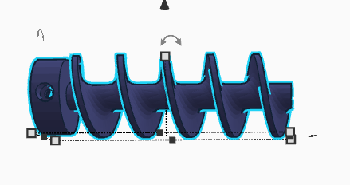

# SB-creator-wq.github.io

---

 <h1>August

* [18.08.2026](#tag-1-einführung-github--18082026)
* [24.08.2026](#tag-2-themasuche--24082026)
* [25.08.2026](#tag-3-recherche--25082026)
* [31.08.2026](#tag-4-recherche--31082026)

 <h1>September

*[01.09.2026](#tag-5-3d-modellierung--01092026)

---
## Tag 1: Einführung GitHub  18.08.2026 

Am zweiten Schultag hatten wir das erste Mal Profilseminar-Physik. Wir wurden heute eingearbeitet in GitHub und haben angefangen uns über das Projekt Gedanken zu machen.

## Tag 2: Themasuche  24.08.2026

Am ersten Tag des Projekts überdenken wir unser Thema. Momentan wollen wir eine Tierfüttermaschiene bauen. 

Laut Recherche bräuchten wir: 

  Mikrocontroller  
  Servomotor  
  Wägezellen-Set  
  Kabel
  
## Tag 3: Recherche  25.08.2026

Nach etwas ausführlicher Recherche benötigen wir:  
  
  Wägezellen 100g  
  APKLVSR Servomotoren.  

Den Rest der benötigten Teile finden wir bei uns zuhause oder in der Schule.

## Tag 4: Recherche  31.08.2026

Heute haben wir weitere Recherche betrieben und wollen uns an diesem Video orientieren: https://www.heise.de/ratgeber/Katzenfuetterungsautomat-mit-Arduino-Mikrocontroller-4663149.html.

## Tag 5: 3D-Modellierung  01.09.2026

Wir haben heute begonnen Formen fürs 3D-Modelling rauszusuchen und selbst zu modellieren.

  
  

