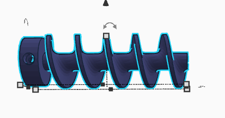
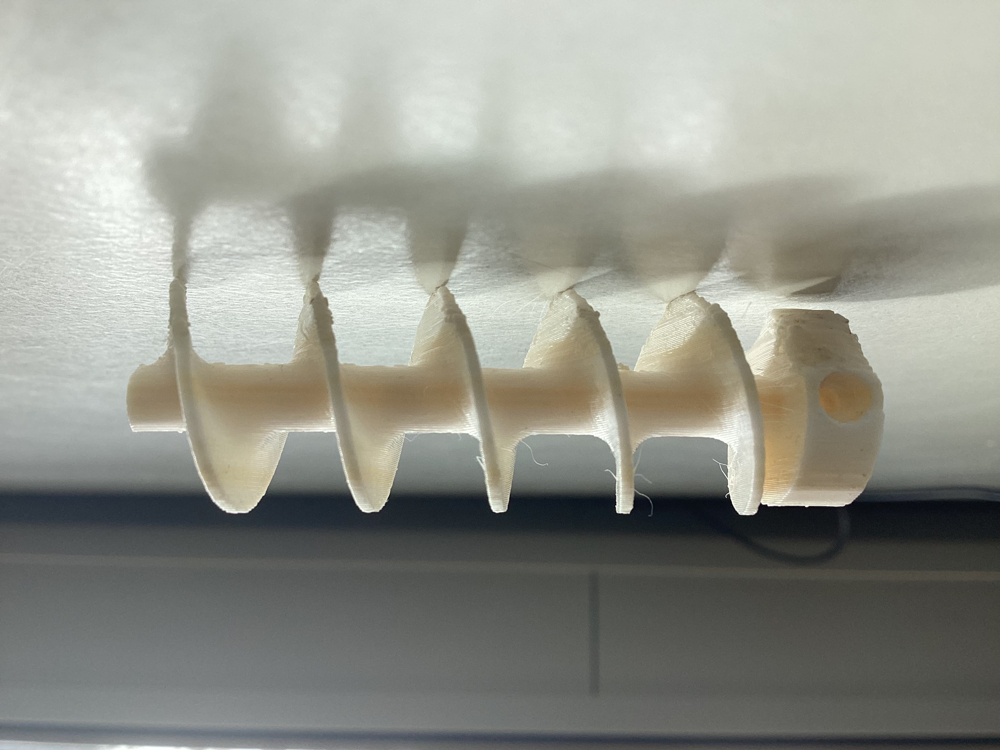

Automatische Hundefuttermaschine

---

 
 
<h1>Vorwort</h1> 
 
 * [Vorwort](#vorwort)

 <h1>August

* [18.08.2026](#tag-1-einführung-github--18082026)
* [24.08.2026](#tag-2-themasuche--24082026)
* [25.08.2026](#tag-3-recherche--25082026)
* [31.08.2026](#tag-4-recherche--31082026)

 <h1>September

* [01.09.2026](#tag-5-3d-modellierung--01092026)  
* [07.09.2026](#tag-6-3d-modellierung--07092026)
* [08.09.2026](#tag-7-einführung-in-arduinos--08092026)
* [08.09.2026](#tag-8-schaltkreisdesign--08092026)
* [08.09.2026](#tag-9-schaltkreisdesign--08092026)
* [08.09.2026](#tag-10-schaltkreisdesign--08092026)
* [08.09.2026](#tag-11-schaltkreisdesign--08092026)
* [08.09.2026](#tag-12-schaltkreisdesign--08092026)
* [08.09.2026](#tag-13-schaltkreisdesign--08092026)

---
## Vorwort

Willkommen zu unserem Blog über unser Physikprofilseminar Projekt. Im ersten Halbjahr haben wir versucht eine automatische Hundefuttermaschine, so gut unsere Möglichkeiten es erlauben, zu bauen.

## Tag 1: Einführung GitHub  18.08.2026 

Am zweiten Schultag/ der ersten Profilseminarstunde haben wir uns in zweier Gruppen zusammengefunden und begannen uns in GitHub einzuarbeiten. Heute haben wir auch schonmal angefangen Gedanken über unser Thema zu machen. Gerade schwanken wir zwischen einem Gimpel und einer automatischen Hundefuttermaschine.  

## Tag 2: Themasuche  24.08.2026

Am zweiten Projekttag haben wir uns für das Thema einer Hundefuttermaschine entschieden. Nachdem wir mehrere Professionelle design angeschaut haben entscheiden wir uns für ein Tornillo-System, wo eine Schraube das Essen "rausdreht". Den Tornillo und das Gehäuse nehmen wir von @maxilar20 bei Printables (https://www.printables.com/model/144105-iot-screw-dog-feeder/files). Wir erweitern dieses Design mit einem selbst designtem Trichter und einem App- System, womit wir die Fütterausgabe remote controllen können.
  
## Tag 3: Recherche  25.08.2026

Heute haben wir uns über die Teilauswahl Gedanken gemacht. Nach längerer Recherche benötigen wir:

<ul>
<li>arduino uno r4 wifi</li>
<li>MG996R Servo</li>
<li>DS3231 RTC-Modul</li>
<li>HC-SR04</li>
</ul>

Der Arduino Uno R4 WiFi bietet uns hierbei perfekt die Remote Kontrollierte App Nutzung. Wir haben uns außerdem noch einen Sensor rausgesucht, welchen wir als Pfoten-Sensor für den Hund nutzen wollen. Diese Idee haben wir erstmals vom Creator EAZYTRONIC im Video: https://www.youtube.com/watch?v=dUB3-fEq5ss bekommen. Bis jetzt sind wir jedoch nicht sicher, ob dieser Sensor im endgültigen Design bleiben wird. 

## Tag 4: Recherche  31.08.2026

Heute haben wir die Teile bestellt und bei weiterer Recherche noch einen interessanten Artikel gefunden (https://www.heise.de/ratgeber/Katzenfuetterungsautomat-mit-Arduino-Mikrocontroller-4663149.html). Das Design mag zwar auf den ersten Blick nicht ähnlich wirken, nutzt jedoch trotzdem ein ähnliches Schrauben Design und hilft uns, als weitere Inspiration.

## Tag 5: 3D-Modellierung  01.09.2026

Heute haben wir ein Tinkercard-Konto erstellt unser Tornillo eingefügt und ihn gedrückt. 

Das Produkt ist ziemlich zufriedenstellend, nur am Boden des Tornillos hatte der 3-Drucker Probleme mit der Rundung. Gerade müssen wir noch überlegen, wie wir das beim Endprodukt vermeiden.  

## Tag 6: 3D-Modellierung  07.09.2026

Heute drucken wir das Gehäuse des Tornillos in 0.5 Größe.

Das Gehäuse ist sehr gut rausgekommen und passt perfekt mit dem Tornillo zusammen, obwohl die Rundungen von diesem nicht perfekt rausgekommen sind.

## Tag 7: Einführung in Arduinos 08.09.2026

Heute sind die Teile angekommen und wir haben uns angefangen mit der Programmiersprache und dem Aufbau eines Arduinos zu beschäftigen. Videos die uns dabei halfen waren: https://www.youtube.com/watch?v=CQPTF6WixiA , https://www.youtube.com/watch?v=_W60alHOtqA.

## Tag 8: Einführung in Arduinos 14.09.2026

Heute haben wir uns weiterhin mit der Programmiersprache und der Verkabelung beschäftigt. Wir haben weiterhin mehrere Videos angesehen wie zum Beispiel: https://www.youtube.com/watch?v=kTUAoJMcCEc.

## Tag 9: Einführung in Arduinos  15.09.2026

Heute haben wir unser Verständnis über die Programmiersprache gefestigt und in diesen Videokurs reingeschaurt: https://www.youtube.com/watch?v=kTUAoJMcCEc.

## Tag 10: Einführung in Arduinos 21.09.2026 

Auch diese Woche beschäftigen wir uns mit dem lernen der Programmiersprache und werden den restlichen Videokurs ansehen.

## Tag 11: Einführung in Arduinos  22.09.2026

Heute haben wir uns den restlichen Videokurs weiter angesehen und haben im Arduino Forum (https://forum.arduino.cc/t/servo-nach-bestimmter-zeit-ansteuern/262647/5) zur Zeitsteuerung eingelesen.

## Tag 12: Schaltkreisdesign  28.09.2026

Da wir nun schon ein eher fundiertes Verständnis über Arduinos und ihre Programmiersprache haben, haben wir uns in Tinkercad am schaltkreisdesign versucht.

## Tag 13: Schaltkreisdesign  28.09.2026

Heute haben wir das Tinkercad Model weiterentwickelt und uns Powerbanks angeschaut um zu sehen, ob wir unser Projekt über Batterie laufen lassen können. 

## Tag 14: Schaltkreisdesign  05.10.2026

Heute war eigentlich geplant den fertigen 3D-Druck und Arduino zusammenzuführen, dadurch das das Fillement aber beschädigt geliefert wurde haben wir heute erstmal den kleinen Prototypen genutzt und mit dem Programmieren angefangen.

